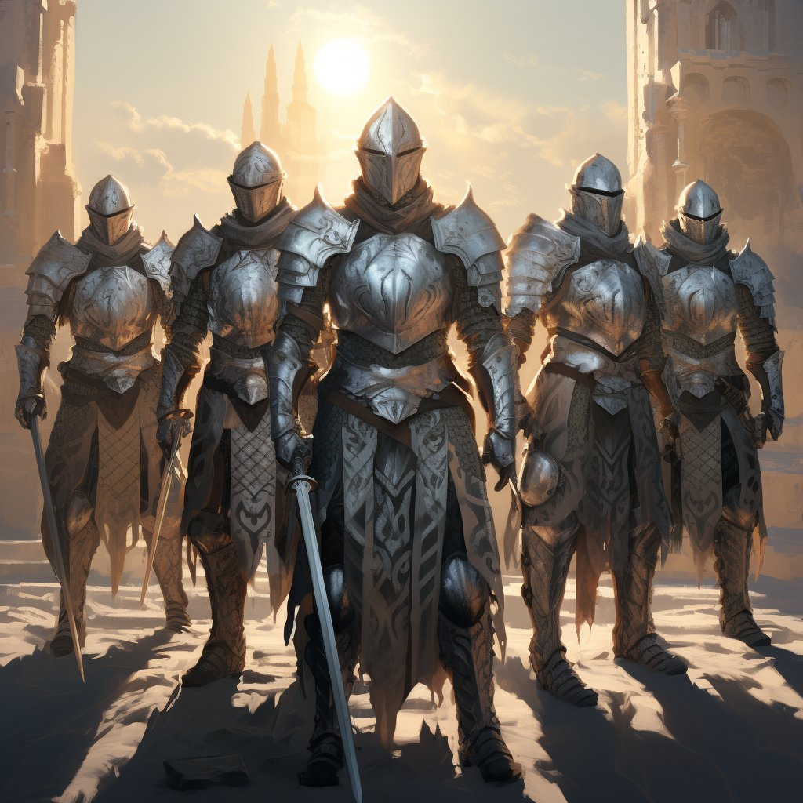
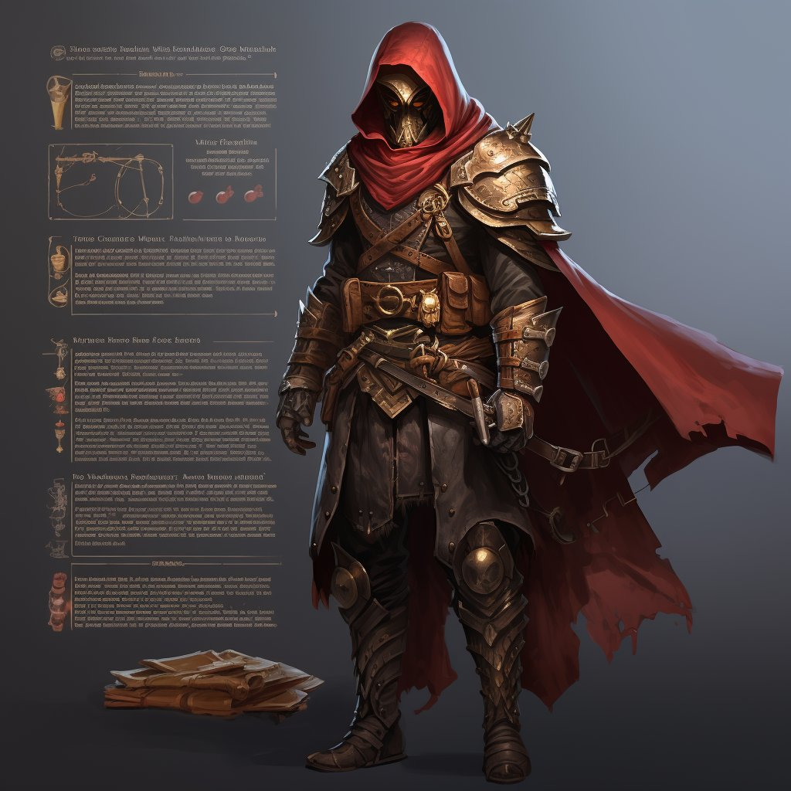
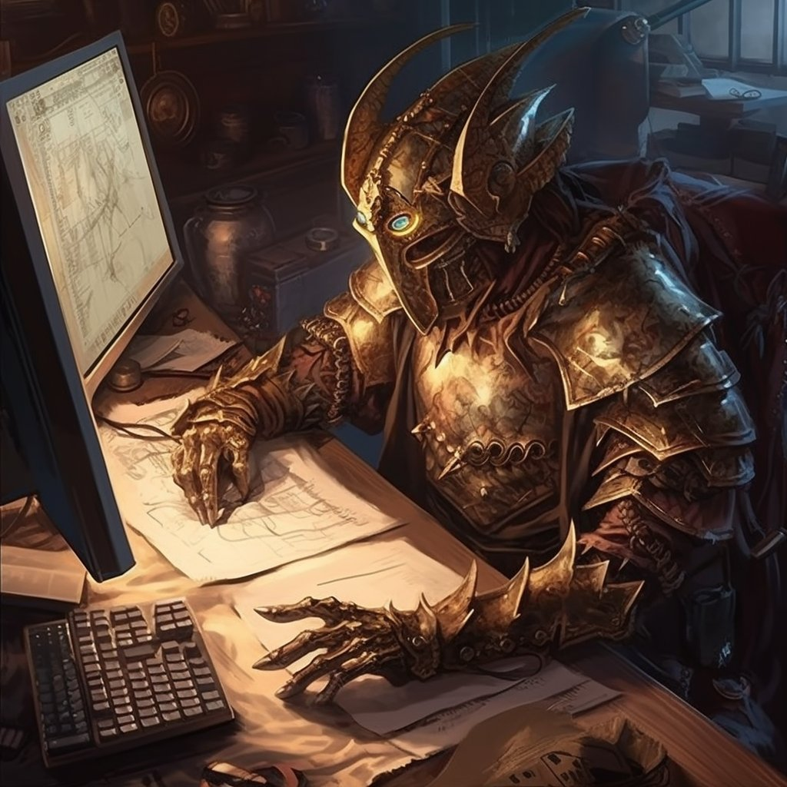
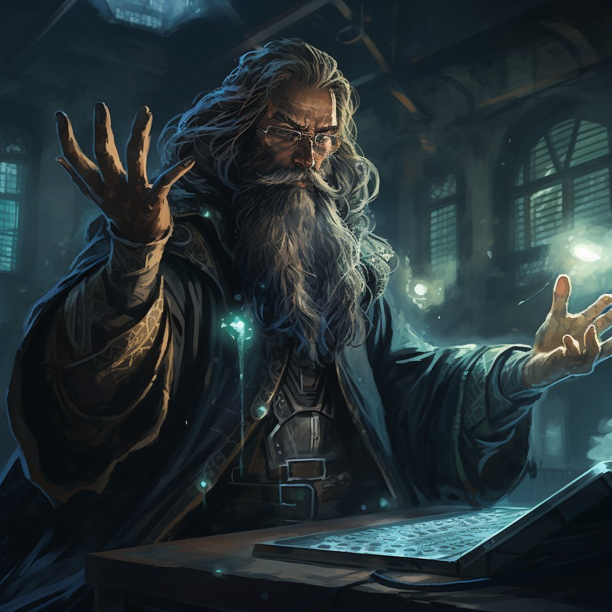
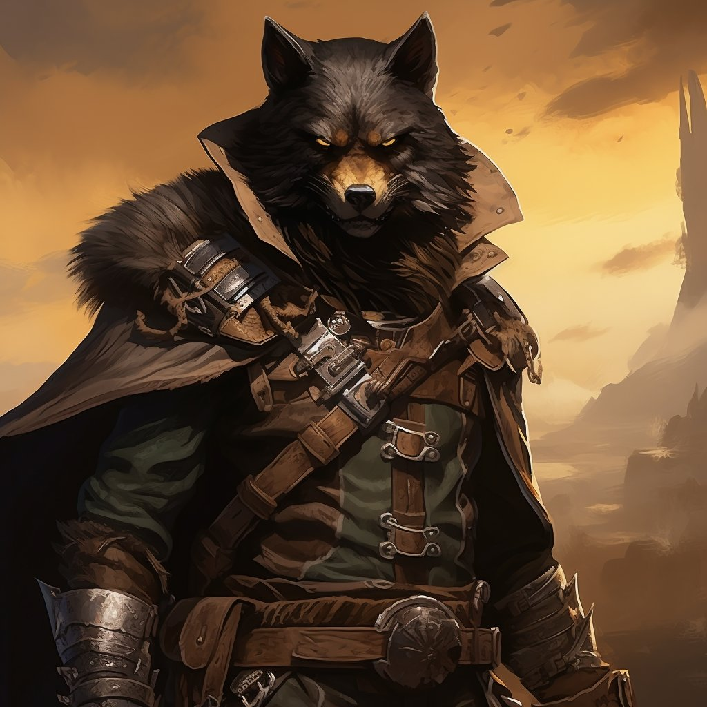
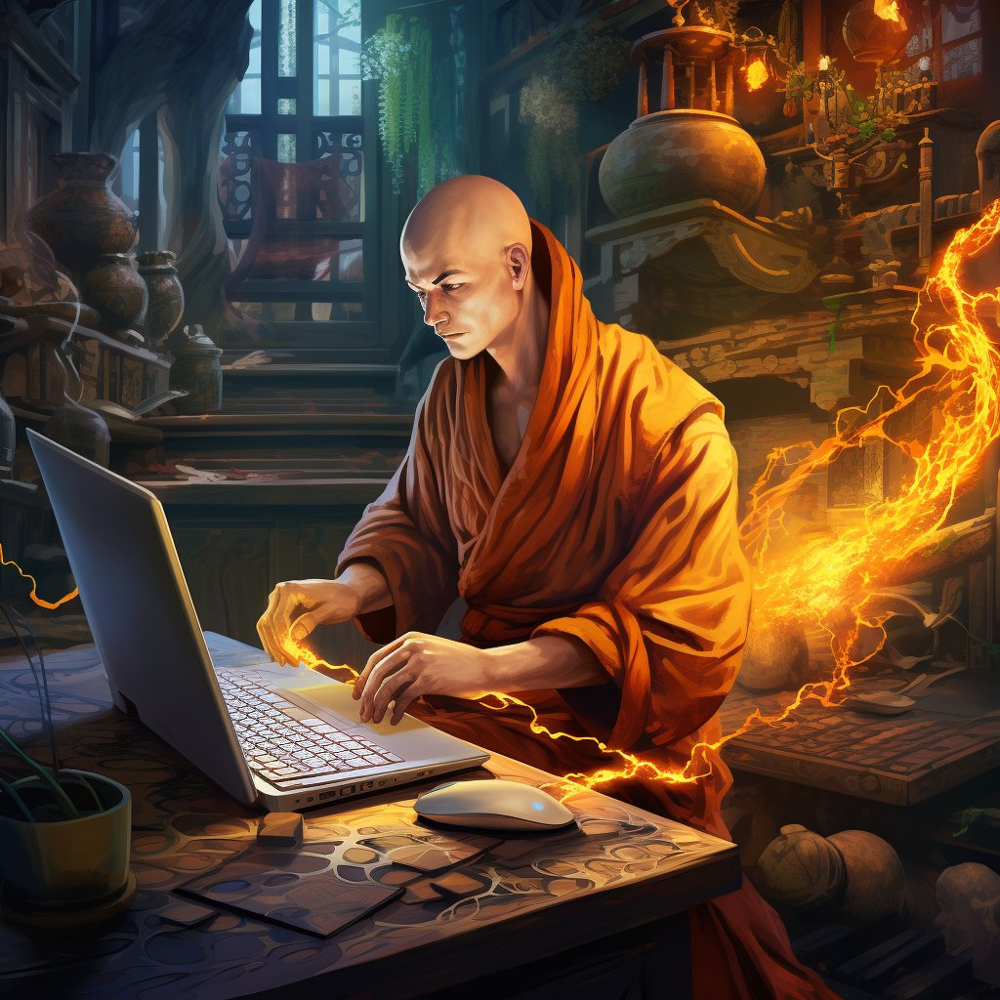
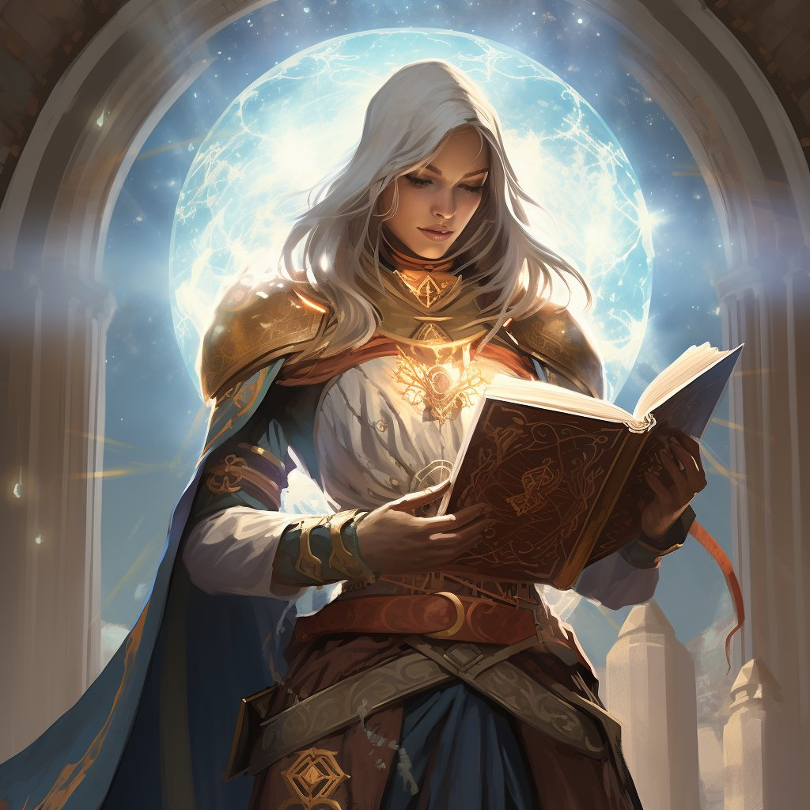
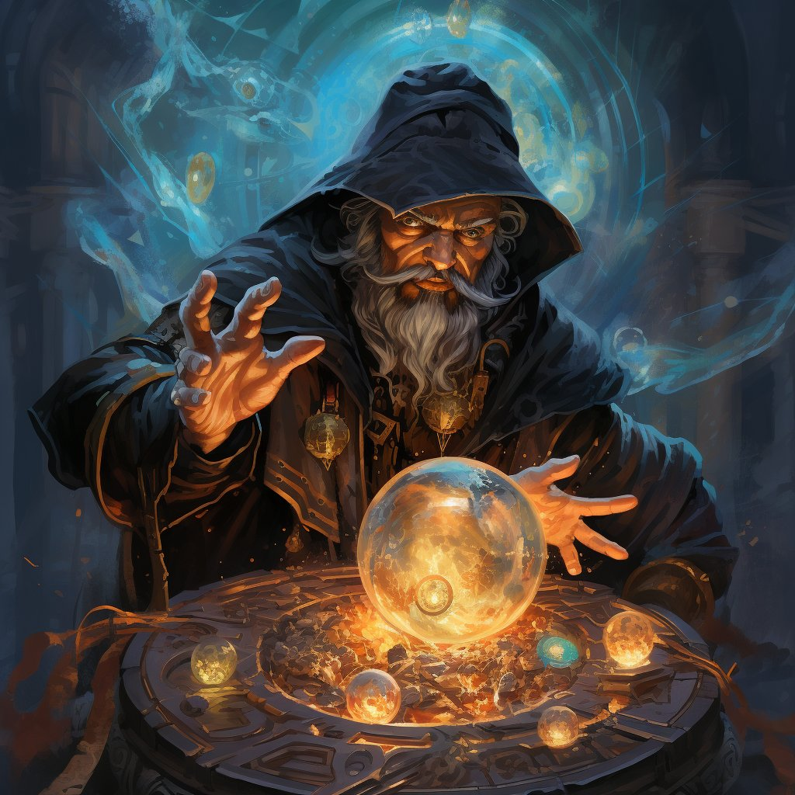
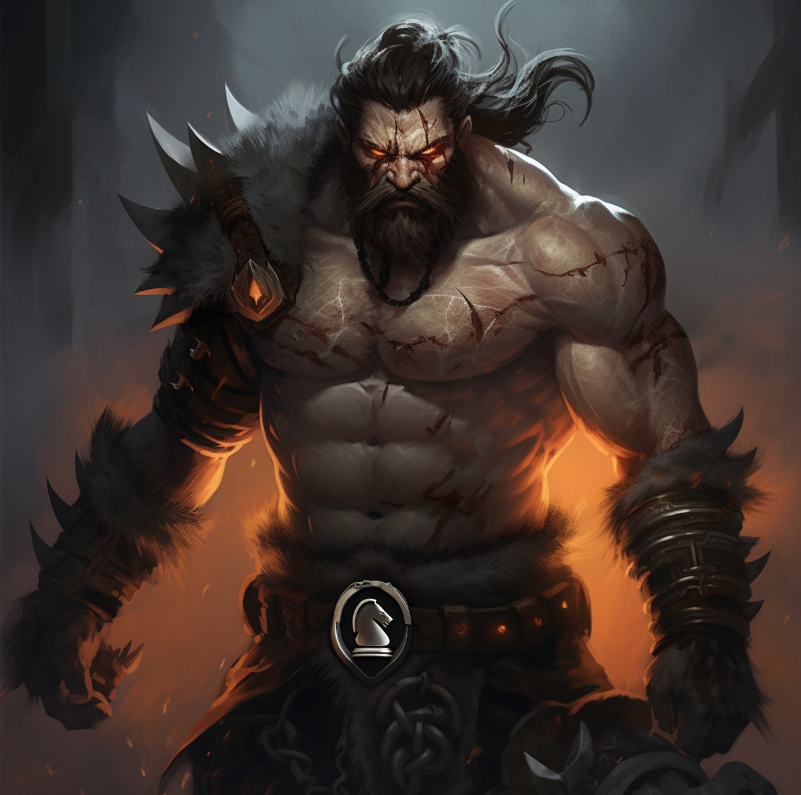

> "Behold, defender of the Etherrealms! With skills refined in the arena of code and tales of your valor spreading wide, myriad paths unfold." - [original tweet](https://twitter.com/devtooligan/status/1695278754300621236?s=20)

## Warrior-Auditor

#### Knight of the Grand Audit House

*Dedicate thy blade and code to a large, noble audit firm. Ride with a band of brethren, auditing as one for the same sigil. Not only shalt thou review incantations, but also have the honor to forge tools of audit magic.*

#### Mercenary Sellsword-Auditor

*Be not tied to one banner but offer thine skills to the highest bidder, engaging in various audit quests across the realm. Freedom accompanies thy work, but with it, uncertainty of constant gold.*

#### Lone Blade Auditor

*Solo audits are thy calling. Though security is thy sword, marketing and self-promotion — is thy shield. Part bard by necessity, be known, and let the realm seek thee for thy services.*

## Mage-Smart Contract Dev

*With arcane incantations and mechanical keyboards, wizards give life to digital constructs, conjuring hyperstructures of great power.  Skilled mages may find full-time, contract, or DAO opportunities paying gold, silver, and platinum coin.*

## Ranger-Bounty Hunter

*These lone wolves, who sometimes hunt in packs, may live off the land for long stretches then find an elusive bug and claim a king's reward. But fortunes are unpredictable, bewares dear fren.  Some rewards promise gold but deliver tin.*

## Monk-Open-Source Builder

*Some choose the path of the selfless enchanter - crafting spells, forging tools, and building infrastructure for the kingdom, nay, the world. A simple life sustained by grants, contributions, and a profound love for the Etherrealms.*

## Paladin-Educator

*Revered for their deep wisdom, these benevolent beings harbor undying passion for the theoretical underpinnings of the Etherrealms. With a heart to uplift and enlighten, they guide fledgling mages and warriors alike, illuminating the path with knowledge.*

## Alchemist-MEV Searcher

*Little is known about these necromancers who are rumored to turn mempools of water into gold. Their skill outmatched only by their secrecy.*

## Berserker-Huffoor

*Their magic is raw and untamed, based on the arcane language of Huff and drawing power from the very chaos of the Etherrealms. Some say they are mad; others claim they possess a clarity most can never attain. One thing is certain, when a Huffoor enters the fray, they plunge headfirst into the heart of chaos, wielding low-level incantations with fierce abandon.*

